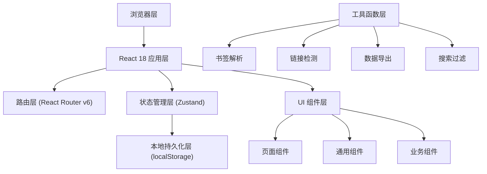
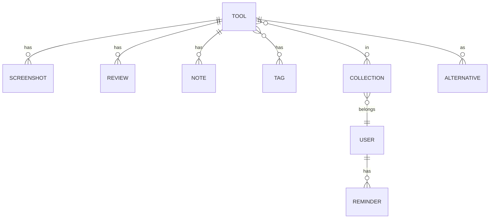

## 1. 架构设计



## 2. 技术描述

- **前端框架**：React@18 + TypeScript@5
- **构建工具**：Vite@5
- **样式方案**：TailwindCSS@3 + CSS Variables
- **路由管理**：React Router@6
- **状态管理**：Zustand@4（轻量级，支持持久化）
- **图标库**：Lucide React（现代化线性图标）
- **数据存储**：localStorage + IndexedDB（截图存储）
- **后端服务**：无（纯前端应用，数据本地存储）
- **数据模拟**：内置 Mock 数据，首次加载时初始化

## 3. 路由定义

| 路由 | 页面 | 说明 |
|------|------|------|
| `/` | 工具首页 | 搜索入口、精选推荐、最近使用 |
| `/library` | 分类库 | 分类浏览、多维度筛选 |
| `/tool/:id` | 工具详情页 | 工具信息、评分、笔记、替代品 |
| `/compare` | 工具对比页 | 多工具参数对比 |
| `/profile` | 个人中心 | 收藏夹、导入导出、提醒 |
| `/collection/:id` | 收藏夹详情 | 单个收藏夹内的工具列表 |

## 4. 数据模型

### 4.1 实体关系图



### 4.2 TypeScript 类型定义

```typescript
// 工具
interface Tool {
  id: string;
  name: string;
  url: string;
  description: string;
  category: string;
  tags: string[];
  price: 'free' | 'freemium' | 'paid';
  priceInfo?: string;
  limitations?: string[];
  screenshots: Screenshot[];
  rating: number;
  reviewCount: number;
  alternatives: string[];
  createdAt: number;
  lastUsedAt?: number;
  isLinkValid: boolean;
  lastCheckedAt: number;
}

// 截图
interface Screenshot {
  id: string;
  url: string;
  thumbnail?: string;
  caption?: string;
  uploadedAt: number;
}

// 评分评论
interface Review {
  id: string;
  toolId: string;
  rating: number;
  comment: string;
  createdAt: number;
}

// 使用笔记
interface Note {
  id: string;
  toolId: string;
  content: string;
  createdAt: number;
  updatedAt: number;
}

// 收藏夹
interface Collection {
  id: string;
  name: string;
  description: string;
  cover?: string;
  toolIds: string[];
  isPublic: boolean;
  shareToken?: string;
  createdAt: number;
  updatedAt: number;
}

// 标签
interface Tag {
  id: string;
  name: string;
  color: string;
  toolCount: number;
}

// 提醒
interface Reminder {
  id: string;
  type: 'broken-link' | 'duplicate' | 'update';
  toolId: string;
  message: string;
  isRead: boolean;
  createdAt: number;
}

// 最近使用记录
interface RecentUse {
  toolId: string;
  usedAt: number;
}

// 应用状态
interface AppState {
  tools: Tool[];
  collections: Collection[];
  tags: Tag[];
  reviews: Review[];
  notes: Note[];
  reminders: Reminder[];
  recentUses: RecentUse[];
  compareList: string[];
}
```

## 5. 目录结构

```
src/
├── assets/              # 静态资源
│   └── mock/            # Mock 数据
├── components/          # 组件
│   ├── common/          # 通用组件
│   │   ├── Button.tsx
│   │   ├── Card.tsx
│   │   ├── Modal.tsx
│   │   ├── Input.tsx
│   │   ├── Rating.tsx
│   │   └── TagBadge.tsx
│   ├── layout/          # 布局组件
│   │   ├── Header.tsx
│   │   ├── Sidebar.tsx
│   │   └── Footer.tsx
│   └── business/        # 业务组件
│       ├── ToolCard.tsx
│       ├── ToolForm.tsx
│       ├── ScreenshotUploader.tsx
│       ├── BookmarkImporter.tsx
│       ├── CollectionSelector.tsx
│       └── FilterPanel.tsx
├── pages/               # 页面组件
│   ├── Home.tsx
│   ├── Library.tsx
│   ├── ToolDetail.tsx
│   ├── Compare.tsx
│   ├── Profile.tsx
│   └── CollectionDetail.tsx
├── store/               # 状态管理
│   ├── useToolStore.ts
│   ├── useCollectionStore.ts
│   └── useUIStore.ts
├── hooks/               # 自定义 Hooks
│   ├── useDebounce.ts
│   ├── useLinkChecker.ts
│   ├── useSearch.ts
│   └── useLocalStorage.ts
├── utils/               # 工具函数
│   ├── bookmarkParser.ts
│   ├── exportUtils.ts
│   ├── linkChecker.ts
│   ├── searchFilter.ts
│   └── idGenerator.ts
├── types/               # 类型定义
│   └── index.ts
├── router/              # 路由配置
│   └── index.tsx
├── styles/              # 全局样式
│   └── globals.css
├── App.tsx
└── main.tsx
```

## 6. 核心功能实现方案

### 6.1 链接有效性检测
- 使用 `fetch` 发送 HEAD 请求检测链接状态
- 跨域问题处理：使用 `no-cors` 模式或提供代理服务
- 定期检测：应用启动时批量检测，新增工具时即时检测
- 状态缓存：检测结果存储在工具数据中，有效期 7 天

### 6.2 浏览器书签导入
- 支持 Netscape 书签格式（Chrome/Firefox/Edge 通用）
- 使用 DOMParser 解析 HTML 书签文件
- 递归解析书签文件夹结构
- 导入时自动去重（基于 URL）
- 支持预览和选择性导入

### 6.3 搜索与筛选
- 基于 Fuse.js 实现模糊搜索
- 支持按名称、描述、标签、分类多字段搜索
- 筛选条件：价格类型、评分区间、标签组合、分类
- 搜索结果高亮关键词

### 6.4 数据导出
- 支持导出为 JSON 格式（完整备份）
- 支持导出为 HTML 书签格式（可导入浏览器）
- 支持生成分享链接（当前仅本地模拟，生成可复制的清单）

### 6.5 图片存储
- 截图使用 Canvas 压缩后转为 Base64
- 大于 1MB 的图片存入 IndexedDB
- 提供缩略图生成功能
