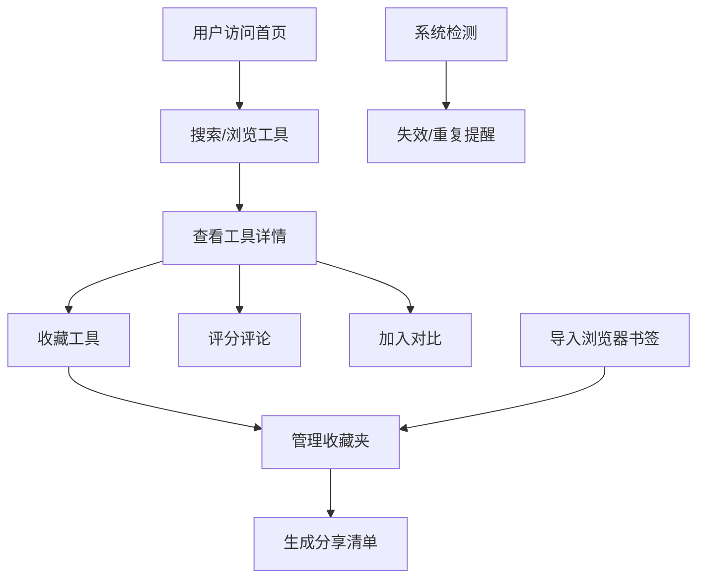

## 1. 产品概述

ToolBox 工具收藏夹是一款面向运营、设计和开发人员的在线工具资产管理平台，帮助用户将零散的工具网址整理成可复用的个人资产库，提升工作效率和工具复用价值。

- 核心价值：解决在线工具收藏零散、难检索、易失效的痛点，构建个人专属工具知识库
- 目标用户：互联网运营人员、UI/UX 设计师、前端/后端开发人员、产品经理等高频使用在线工具的专业人士

## 2. 核心功能

### 2.1 用户角色

| 角色 | 注册方式 | 核心权限 |
|------|---------|---------|
| 普通用户 | 本地存储（无需注册） | 浏览、收藏、管理、导入、分享工具 |

### 2.2 功能模块

1. **工具首页**：精选推荐、快速搜索、最近使用、热门分类
2. **分类库**：按类别浏览、多维度筛选、标签云
3. **详情页**：工具信息展示、截图预览、评分评论、替代品推荐
4. **对比页**：多工具横向对比、参数对比表格、一键生成对比报告
5. **个人中心**：收藏夹管理、使用笔记、导入导出、个性化设置

### 2.3 页面详情

| 页面名称 | 模块名称 | 功能描述 |
|---------|---------|---------|
| 工具首页 | Hero 搜索区 | 全局关键词搜索、快捷添加入口 |
| 工具首页 | 精选推荐 | 展示高评分、常用工具卡片 |
| 工具首页 | 最近使用 | 按时间倒序展示最近访问的工具 |
| 工具首页 | 热门分类 | 展示工具分类入口及数量统计 |
| 分类库 | 分类导航 | 左侧分类树、支持多级分类 |
| 分类库 | 筛选器 | 关键词搜索、标签筛选、价格筛选、评分筛选 |
| 分类库 | 工具列表 | 卡片/列表视图切换、排序功能 |
| 详情页 | 基本信息 | 名称、链接、描述、价格、使用限制 |
| 详情页 | 媒体展示 | 截图轮播、截图放大预览 |
| 详情页 | 评分系统 | 5星评分、评分统计、用户点评 |
| 详情页 | 收藏操作 | 加入收藏夹、标记替代品、写使用笔记 |
| 对比页 | 对比选择器 | 添加/移除对比工具、最多支持4个对比 |
| 对比页 | 对比表格 | 多维度参数对比、差异高亮显示 |
| 个人中心 | 收藏夹管理 | 创建/编辑/删除收藏夹、按场景分类 |
| 个人中心 | 书签导入 | 批量导入浏览器书签、自动去重 |
| 个人中心 | 分享清单 | 生成可分享的收藏清单链接 |
| 个人中心 | 提醒中心 | 失效链接提醒、重复收藏提醒 |

## 3. 核心流程

### 3.1 工具收藏流程
用户在首页点击"添加工具" → 填写工具链接/名称/描述/标签 → 上传截图 → 选择收藏夹 → 系统自动检测链接有效性和重复性 → 保存成功

### 3.2 工具发现流程
用户在首页搜索关键词 → 系统按相关度排序展示结果 → 用户筛选分类/标签/评分 → 进入详情页查看 → 收藏/评分/对比

### 3.3 书签导入流程
用户进入个人中心 → 选择"导入书签" → 上传浏览器导出的 HTML 文件 → 系统解析并预览 → 用户选择要导入的书签 → 自动去重和分类 → 导入完成

## 4. 用户界面设计

### 4.1 设计风格
- **主色调**：深蓝色 (#165DFF) 作为品牌主色，传递专业、可信赖的科技感
- **辅助色**：亮青色 (#0FC6C2) 用于强调和交互元素，暖橙色 (#FF7D00) 用于提醒和警告
- **中性色**：多层次灰色系 (#1D2129, #4E5969, #86909C, #C9CDD4, #F2F3F5) 确保内容可读性
- **按钮风格**：圆角 8px，主按钮填充色+白字，次要按钮描边样式，悬停时有细微阴影和微动画
- **字体选择**：展示字体使用 "Inter" 搭配 "PingFang SC"，正文使用系统字体栈，确保跨平台一致性
- **布局风格**：卡片式布局，充足留白，网格化结构，信息层次分明
- **图标风格**：线性图标，2px 描边，圆角端点，保持统一视觉语言

### 4.2 页面设计概述

| 页面名称 | 模块名称 | UI 元素 |
|---------|---------|---------|
| 工具首页 | Hero 搜索区 | 大标题、搜索框带图标、快捷添加按钮、渐变背景、微粒子动效 |
| 工具首页 | 精选推荐 | 工具卡片网格、悬停放大效果、评分星星、标签徽章 |
| 工具首页 | 最近使用 | 横向滚动条、时间标签、快速访问按钮 |
| 分类库 | 分类导航 | 可折叠侧边栏、分类图标、数量徽章 |
| 分类库 | 筛选器 | 标签云、价格滑块、评分下拉、视图切换按钮 |
| 详情页 | 基本信息 | 工具Logo、标题、链接按钮、价格标签、限制提示 |
| 详情页 | 媒体展示 | 截图轮播、左右箭头、指示器、点击放大模态框 |
| 对比页 | 对比表格 | 固定首列、差异高亮、参数分组、导出按钮 |
| 个人中心 | 侧边导航 | 图标+文字、激活态高亮、折叠/展开 |

### 4.3 响应式设计
- **桌面优先**：1440px 为基准设计，支持 1280px-1920px 自适应
- **平板适配**：1024px 断点，侧边栏折叠为图标模式，网格改为 2 列
- **手机适配**：768px 断点，底部导航栏，单列布局，优化触摸交互区域
- **触摸优化**：最小点击区域 44x44px，滑动手势支持，取消悬停状态

### 4.4 动效设计
- **页面加载**：骨架屏占位，内容渐入，列表项交错动画
- **滚动效果**：导航栏透明度变化，回到顶部按钮淡入
- **交互动效**：按钮点击缩放反馈，卡片悬停上浮+阴影加深，模态框弹性动画
- **状态反馈**：操作成功的绿色勾动画，错误提示的抖动效果，加载中的旋转动效
